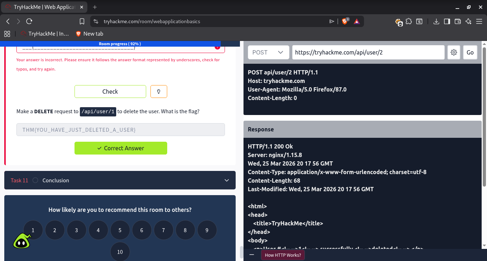

# 🔍 TryHackMe - Passive Reconnaissance (Day 2)

## 📅 Date
26 March 2026

---

## 🚀 What I Learned

Today I performed **Passive Reconnaissance** using real tools like WHOIS, NSLOOKUP, and DIG.

Passive recon collects information **without directly interacting with the target system**, making it safe and legal.

---

## 🧠 Practical Analysis (Real Target)

### 🎯 Target Domain:techforage.in
 
---

## 1️⃣ WHOIS Analysis

**Command:**

**Key Findings:**
- Registrar: GoDaddy  
- Creation Date: 2014  
- Expiry Date: 2028  
- Location: Tamil Nadu, India  
- Name Servers:
  - ns1.bluehost.in  
  - ns2.bluehost.in  

👉 Insight:  
- Domain is **active and long-term registered**  
- Hosting likely on **Bluehost infrastructure**

---

## 2️⃣ NSLOOKUP (Reverse Lookup)

**Command:**

👉 Insight:
- IP belongs to **web hosting service**
- Indicates **shared hosting environment**

---

## 🔬 Raw Output (Lab Evidence)

Included actual command outputs from lab:

:contentReference[oaicite:0]{index=0}

---

## ⚠️ Key Concepts

- WHOIS reveals domain ownership & infrastructure  
- DNS lookup reveals hosting details  
- Passive recon uses **public data only**  

---

## 📸 Screenshot

---

## 🎯 Takeaways

- Even basic tools reveal critical infrastructure  
- DNS and WHOIS = powerful intelligence sources  
- Real-world recon starts with passive methods  

---

## 🔥 Next Step

- Active Recon (Nmap scanning)  
- Subdomain enumeration  
- Web vulnerability testing  

---

## 💀 Goal

Build strong recon skills → move to bug bounty & real pentesting
